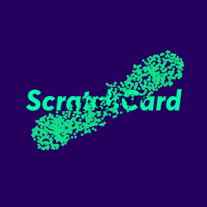

# Scratchcard-js 


ScratchCard is a js lib to simulated a scratchcard in browser with html5 and canvas.



## Install
You can install ScratchCard with npm:
```
npm install scratchcard-js
```
or just clone this repo
```
git clone https://github.com/Masth0/ScratchCard.git
```
and pick in the folder **./build** the file **scratchard.min.js**

## Getting started

```js
import ScratchCard from 'scratchcard-js';

let sc = new ScratchCard('#js--scratchcard--container', {
     scratchType: SCRATCH_TYPE.SPRAY,
     containerWidth: 300,
     containerHeight: 300,
     imageForwardSrc: './images/scratchcard.png',
     imageBackgroundSrc: './images/scratchcard-background.png',
     clearZoneRadius: 50,
     nPoints: 30,
     pointSize: 4,
     callback: function() {
         alert('done.')
     }
 });

// Init the scratchcard
// ScratchCard check if the imageForwardSrc is loaded before continuing for not reveal the background image.
sc.init().then(() => {
  // complete, doing what you want. Get the percent of scratchcard ?
  test.canvas.addEventListener('scratch.move', function() {
    let percent = test.getPercent();
    console.log(percent);
  });
}).catch((error) => {
  alert(error.message);
});
```

## Brushes (coming soon)
...

## Events
**'scratch.move'**
```js
sc.canvas.addEventListener('scratch.move', function() {
  let percent = test.getPercent();
  console.log(percent);
});
```